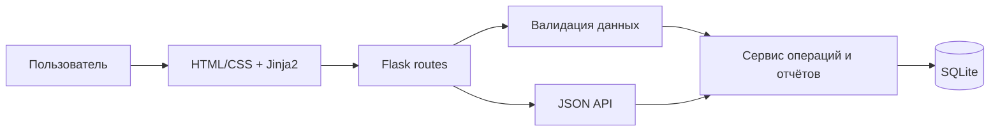
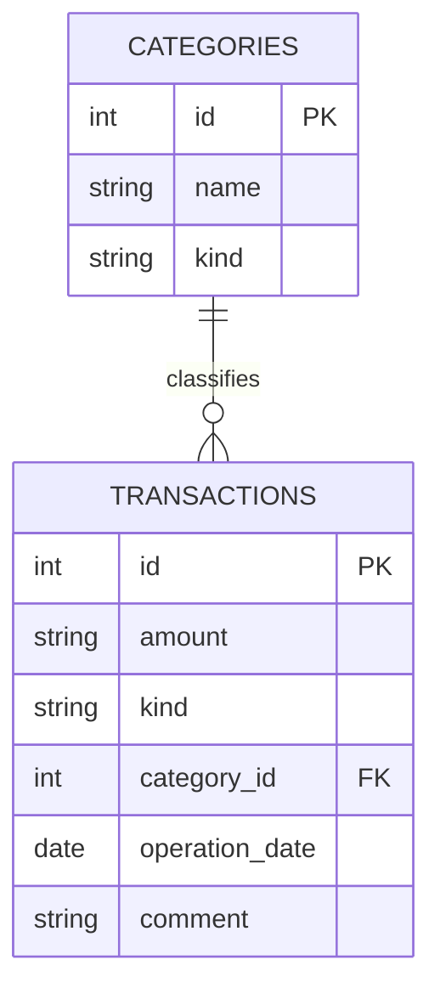

# Архитектура FinTrack

```mermaid
flowchart LR
 U[Пользователь] --> UI[HTML/CSS + Jinja2] --> R[Flask routes]
 R --> V[Валидация данных] --> S[Сервис операций и отчётов]
 S --> D[(SQLite)]
 R --> API[JSON API] --> S
```

```mermaid
erDiagram
 CATEGORIES ||--o{ TRANSACTIONS : classifies
 CATEGORIES { int id PK string name string kind }
 TRANSACTIONS { int id PK string amount string kind int category_id FK date operation_date string comment }
```
